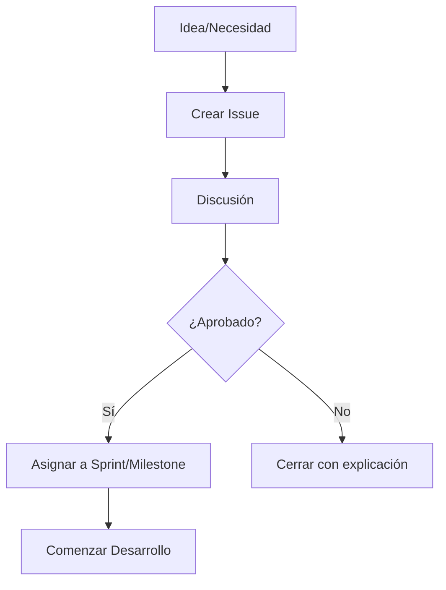
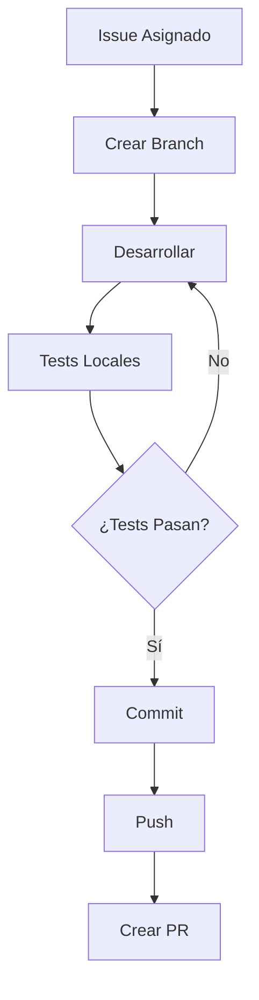
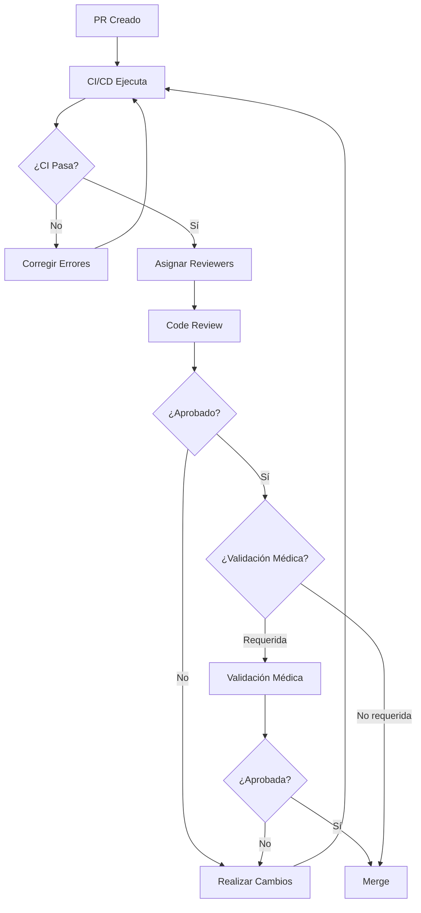
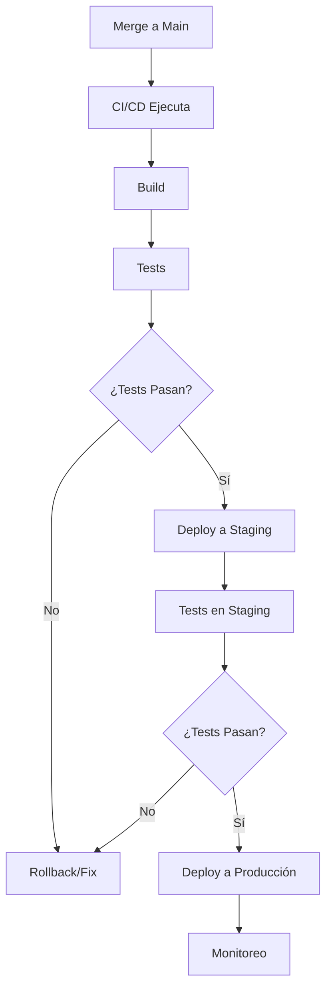

# Flujo de Trabajo - Git-MedUC

Este documento describe el flujo de trabajo estándar para proyectos de Git-MedUC.

## Tabla de Contenidos
- [Flujo de Trabajo General](#flujo-de-trabajo-general)
- [Workflow de Git](#workflow-de-git)
- [Proceso de Code Review](#proceso-de-code-review)
- [Proceso de Release](#proceso-de-release)
- [Gestión de Issues](#gestión-de-issues)

## Flujo de Trabajo General

### 1. Planificación



**Pasos**:
1. Identificar necesidad o problema
2. Crear issue usando template apropiado
3. Discutir en el issue
4. Comité técnico o líder de proyecto aprueba
5. Asignar prioridad y milestone
6. Asignar a desarrollador

### 2. Desarrollo



**Pasos**:
1. Crear branch desde `main` (o `develop` si existe)
2. Desarrollar la funcionalidad/fix
3. Escribir tests
4. Ejecutar tests localmente
5. Commit con mensaje descriptivo
6. Push al repositorio remoto
7. Crear Pull Request

### 3. Revisión



**Pasos**:
1. CI/CD ejecuta automáticamente
2. Se asignan reviewers (automático o manual)
3. Reviewers revisan el código
4. Se discuten cambios necesarios
5. Autor implementa cambios solicitados
6. Validación médica si aplica
7. Aprobación final
8. Merge a branch principal

### 4. Deployment



## Workflow de Git

### Estrategia de Branches

Usamos **GitHub Flow** (simplificado):

```
main (producción)
  ↑
  └── feature/nueva-funcionalidad
  └── fix/correccion-bug
  └── docs/actualizar-readme
  └── medical-validation/validar-algoritmo
```

#### Branch Principal: `main`
- Siempre deployable
- Protegida: requiere PR y aprobación
- CI/CD debe pasar antes de merge

#### Feature Branches
**Nomenclatura**: `feature/descripcion-corta`

**Ejemplo**: `feature/deteccion-riesgo-suicida`

**Para**:
- Nuevas funcionalidades
- Mejoras significativas

#### Fix Branches
**Nomenclatura**: `fix/descripcion-del-bug`

**Ejemplo**: `fix/calculo-score-phq9`

**Para**:
- Corrección de bugs
- Hot fixes

#### Docs Branches
**Nomenclatura**: `docs/descripcion`

**Ejemplo**: `docs/agregar-ejemplos-api`

**Para**:
- Cambios solo en documentación

#### Medical Validation Branches
**Nomenclatura**: `medical-validation/descripcion`

**Ejemplo**: `medical-validation/protocolo-gad7`

**Para**:
- Validaciones médicas
- Cambios en protocolos clínicos

### Comandos Git Comunes

#### Crear y Cambiar a Nueva Branch
```bash
git checkout -b feature/mi-funcionalidad
```

#### Mantener Branch Actualizada
```bash
git fetch origin
git rebase origin/main
```

#### Commit
```bash
git add .
git commit -m "feat: Agregar detección de ansiedad con GAD-7"
```

#### Push
```bash
git push origin feature/mi-funcionalidad
```

#### Actualizar PR después de feedback
```bash
# Hacer cambios
git add .
git commit -m "fix: Corregir validación de input según feedback"
git push origin feature/mi-funcionalidad
```

### Mensajes de Commit

Seguimos [Conventional Commits](https://www.conventionalcommits.org/):

**Formato**:
```
<tipo>(<alcance opcional>): <descripción>

<cuerpo opcional>

<footer opcional>
```

**Tipos**:
- `feat`: Nueva funcionalidad
- `fix`: Corrección de bug
- `docs`: Documentación
- `style`: Formato (no afecta código)
- `refactor`: Refactorización
- `test`: Tests
- `chore`: Mantenimiento
- `medical`: Validación médica

**Ejemplos**:
```bash
feat(phq9): Agregar cálculo de severidad de depresión

Implementa algoritmo para clasificar severidad según
score del PHQ-9: mínima, leve, moderada, severa.

Refs: #42

fix(gad7): Corregir cálculo de puntos invertidos

Los items 3 y 7 estaban siendo calculados incorrectamente.
Ahora sigue el protocolo estándar.

Refs: #56
Fixes: #58

docs: Actualizar README con ejemplos de uso

medical(hamd): Validar protocolo Hamilton Depression Scale

Revisado y aprobado por Dr. García
Seguimiento del protocolo HAM-D-17 estándar

Validated-by: Dr. García <garcia@example.com>
Refs: #89
```

## Proceso de Code Review

### Para Autores de PR

#### Antes de Solicitar Review
- [ ] Todos los tests pasan localmente
- [ ] El código sigue los estándares del proyecto
- [ ] La documentación está actualizada
- [ ] El PR es pequeño y enfocado (idealmente < 400 líneas)
- [ ] El título y descripción son claros
- [ ] Se han completado todos los campos de la plantilla de PR

#### Durante el Review
1. **Responde rápidamente** a comentarios
2. **Sé receptivo** al feedback
3. **Explica tu razonamiento** si discrepas
4. **Pregunta** si algo no está claro
5. **Agradece** el tiempo del reviewer
6. **Resuelve conversaciones** cuando hagas cambios

#### Responder a Comentarios
```markdown
✅ Buena respuesta:
"Buen punto. He cambiado el enfoque para usar X en lugar de Y 
porque [razón]. Ver commit abc123."

❌ Mala respuesta:
"No, mi forma es mejor."
```

### Para Reviewers

#### Qué Revisar
1. **Funcionalidad**: ¿Hace lo que debería?
2. **Tests**: ¿Hay tests adecuados?
3. **Código**: ¿Es legible, mantenible?
4. **Documentación**: ¿Está actualizada?
5. **Seguridad**: ¿Hay problemas de seguridad?
6. **Performance**: ¿Hay problemas de rendimiento obvios?
7. **Validación médica**: ¿Es clínicamente correcto?

#### Cómo Dar Feedback

**Clasifica tus comentarios**:
- 🔴 **Bloqueante**: Debe cambiarse antes de merge
- 🟡 **Sugerencia**: Mejora pero no bloqueante
- 🔵 **Pregunta**: Necesito aclaración
- 💡 **Nitpick**: Detalle menor, considera pero no bloqueante

**Ejemplo de buenos comentarios**:
```markdown
🔴 Bloqueante: Este cálculo del PHQ-9 no sigue el protocolo estándar.
El item 9 debe ponderarse diferente. Ver: [referencia]

🟡 Sugerencia: Considera extraer esta lógica a una función separada
para mejorar legibilidad y reutilización.

🔵 Pregunta: ¿Por qué usamos threshold de 10 aquí? 
La literatura sugiere 15 para severidad moderada.

💡 Nitpick: Typo en comentario: "calcualr" -> "calcular"
```

#### Proceso de Review
1. Lee la descripción del PR completamente
2. Revisa el código archivos por archivo
3. Ejecuta el código localmente si es necesario
4. Deja comentarios específicos en líneas relevantes
5. Resumen general al final si es apropiado
6. Aprueba, solicita cambios, o comenta

#### Tiempo de Review
- PRs pequeños (< 200 líneas): revisar en 1 día hábil
- PRs medianos (200-400 líneas): revisar en 2 días hábiles  
- PRs grandes (> 400 líneas): considerar dividir o revisar en 3 días

## Proceso de Release

### Versionado

Seguimos [Semantic Versioning](https://semver.org/):

**Formato**: `MAJOR.MINOR.PATCH`

- **MAJOR**: Cambios incompatibles de API
- **MINOR**: Nueva funcionalidad compatible hacia atrás
- **PATCH**: Bug fixes compatibles hacia atrás

**Ejemplos**:
- `1.0.0` → `1.0.1`: Bug fix
- `1.0.0` → `1.1.0`: Nueva funcionalidad
- `1.0.0` → `2.0.0`: Breaking change

### Proceso de Release

#### 1. Preparación
```bash
# Asegurar que main está actualizado
git checkout main
git pull origin main

# Crear branch de release
git checkout -b release/v1.2.0
```

#### 2. Actualizar Versión
- Actualizar número de versión en archivos relevantes
- Actualizar CHANGELOG.md
- Actualizar documentación si es necesario

#### 3. Testing Final
```bash
# Ejecutar todos los tests
npm test
# o
pytest
# o
R CMD check .

# Tests de integración
# Tests end-to-end si aplica
```

#### 4. Crear PR de Release
- Crear PR de `release/v1.2.0` a `main`
- Título: "Release v1.2.0"
- Incluir changelog en descripción
- Requiere aprobación de mantenedores

#### 5. Merge y Tag
```bash
# Después de merge del PR
git checkout main
git pull origin main

# Crear tag
git tag -a v1.2.0 -m "Release v1.2.0"
git push origin v1.2.0
```

#### 6. Publicar Release en GitHub
1. Ir a Releases en GitHub
2. Draft new release
3. Seleccionar tag v1.2.0
4. Título: v1.2.0
5. Descripción: Copiar changelog
6. Publish release

#### 7. Deployment
- CI/CD automáticamente deploya desde tag (si está configurado)
- O manual deployment según proceso del proyecto

## Gestión de Issues

### Ciclo de Vida de un Issue

```
Nuevo → Triaged → Asignado → En Progreso → En Review → Cerrado
                ↓
              Rechazado
```

### Estados (Labels)

#### Por Estado
- `new`: Recién creado, pendiente de triage
- `triaged`: Revisado y categorizado
- `in-progress`: En desarrollo activo
- `in-review`: En code review
- `blocked`: Bloqueado por dependencia
- `on-hold`: En pausa

#### Por Tipo
- `bug`: Error en el código
- `enhancement`: Nueva funcionalidad
- `documentation`: Mejora de docs
- `medical-validation`: Validación médica requerida
- `question`: Pregunta

#### Por Prioridad
- `priority-critical`: Resolver inmediatamente
- `priority-high`: Resolver pronto
- `priority-medium`: Resolver en próximo sprint
- `priority-low`: Resolver cuando sea posible

#### Por Esfuerzo
- `effort-xs`: < 2 horas
- `effort-s`: < 1 día
- `effort-m`: 1-3 días
- `effort-l`: 1 semana
- `effort-xl`: > 1 semana

#### Otros
- `good-first-issue`: Bueno para nuevos colaboradores
- `help-wanted`: Se busca ayuda externa
- `duplicate`: Duplicado de otro issue
- `wontfix`: No se implementará

### Triage Process

**Frecuencia**: Diario o según volumen

**Responsable**: Líder de proyecto o mantenedor

**Proceso**:
1. Revisar issues nuevos
2. Validar que están completos
3. Asignar tipo, prioridad, esfuerzo
4. Asignar a milestone si aplica
5. Asignar a persona si aplica
6. Cerrar si es duplicado o inválido

### Priorización

**Criterios**:
1. **Impacto médico/clínico**: Mayor impacto = mayor prioridad
2. **Usuarios afectados**: Más usuarios = mayor prioridad
3. **Severidad**: Bugs críticos > features
4. **Esfuerzo**: Quick wins pueden tener prioridad
5. **Dependencias**: Issues bloqueantes tienen prioridad

## Mejores Prácticas

### Do's ✅
- Mantén PRs pequeños y enfocados
- Escribe buenos mensajes de commit
- Incluye tests con cambios de código
- Actualiza documentación
- Responde a reviews rápidamente
- Comunica blockers temprano
- Valida médicamente cuando sea necesario

### Don'ts ❌
- No hagas PRs gigantes (> 500 líneas)
- No hagas commits con mensajes vagos ("fix", "update")
- No ignores feedback de reviews
- No mergees sin aprobación
- No incluyas cambios no relacionados
- No ignores tests que fallan
- No hagas afirmaciones médicas sin respaldo

---

**Este documento es vivo y se actualiza regularmente. Última actualización: Enero 2025**
